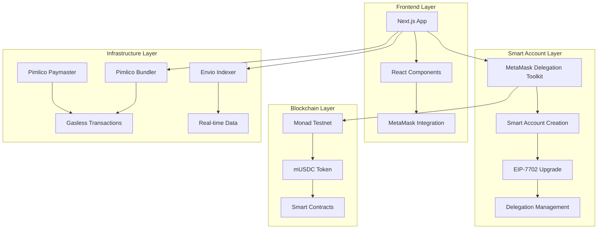
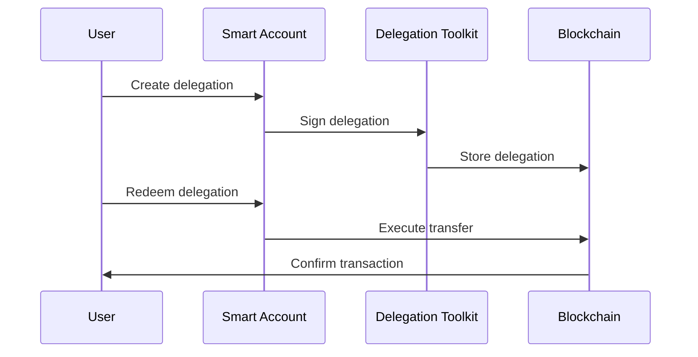
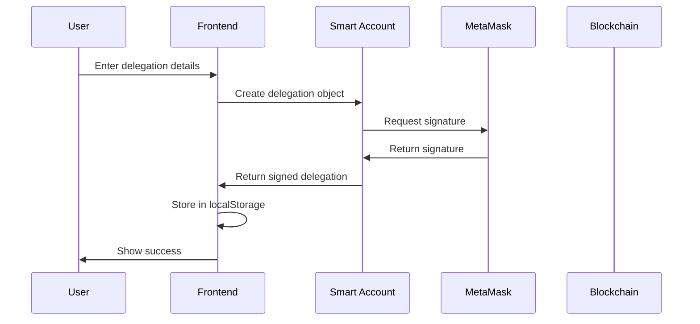
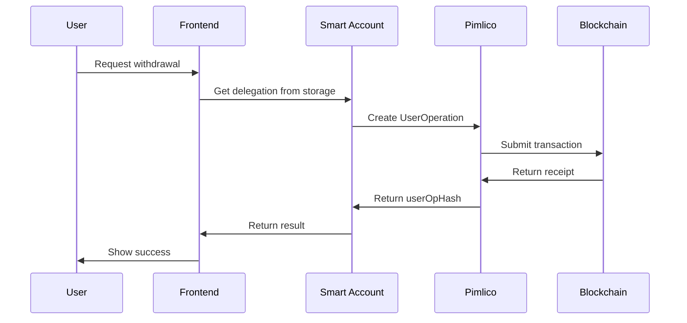
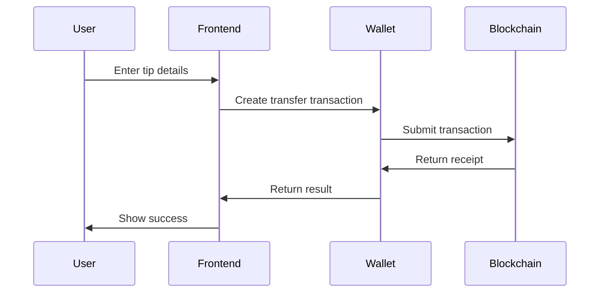

# Architecture Documentation

## System Overview

This document describes the architecture of the MetaMask Smart Accounts dApp on Monad testnet, focusing on the delegation system, gasless transactions, and social coordination features.

## High-Level Architecture



## Core Components

### 1. Smart Account Management (`lib/smartAccount.ts`)

**Purpose**: Manages MetaMask Smart Account creation and operations.

**Key Functions**:
- `getDevSmartAccount()`: Creates smart account for development
- `getMetaMaskSmartAccount()`: Creates smart account from MetaMask connection

**Implementation**:
```typescript
const saImpl = await toMetaMaskSmartAccount({
  client: publicClient,
  implementation: Implementation.Hybrid,
  deployParams: [userAccount, [], [], []],
  deploySalt: "0x",
  signer: { walletClient },
});
```

### 2. Delegation System (`lib/delegation.ts`)

**Purpose**: Handles delegation creation, signing, and redemption.

**Key Functions**:
- `createDelegationWrapper()`: Creates and signs delegations
- `redeemDelegationGasless()`: Gasless delegation redemption
- `redeemDelegationReal()`: Regular delegation redemption

**Delegation Flow**:


### 3. Gasless Transactions

**Purpose**: Enables users to perform transactions without paying gas fees.

**Implementation**:
- Uses Pimlico bundler for UserOperation submission
- Uses Pimlico paymaster for gas sponsorship
- Falls back to regular transactions if gasless fails

**Flow**:
```typescript
// Create bundler and paymaster clients
const bundlerClient = createBundlerClient({
  transport: http(bundlerRpcUrl),
});

const paymasterClient = createPaymasterClient({
  transport: http(paymasterRpcUrl),
});

// Send gasless UserOperation
const userOpHash = await smartAccountClient.sendUserOperation({
  to: contractAddress,
  data: calldata,
  value: 0n,
});
```

### 4. Social Coordination (`app/dashboard/page.tsx`)

**Purpose**: Provides social features like tipping and activity feeds.

**Features**:
- Real-time transaction feeds
- Tip filtering and display
- Delegation activity tracking
- Social interaction metrics

### 5. Automated Subscriptions (`scripts/automated-subscriptions.js`)

**Purpose**: Automates recurring payments based on delegation schedules.

**Logic**:
```javascript
// Check if delegation period has passed
const periodsPassed = Math.floor(elapsed / periodDuration);
const shouldRedeem = periodsPassed > 0 && 
                    (!delegation.lastRedeemed || 
                     delegation.lastRedeemed < currentPeriodStart);

if (shouldRedeem) {
  await redeemDelegationGasless(delegation);
}
```

## Data Flow

### 1. Delegation Creation Flow



### 2. Delegation Redemption Flow



### 3. Social Tip Flow



## Security Architecture

### 1. Input Validation

```typescript
export function sanitizeAddress(address: string): string {
  if (!address.match(/^0x[a-fA-F0-9]{40}$/)) {
    throw new ValidationError('Invalid address format');
  }
  return address.toLowerCase().trim();
}

export function validateAmount(amount: number): number {
  if (amount <= 0 || amount > 1000000) {
    throw new ValidationError('Invalid amount');
  }
  return amount;
}
```

### 2. Error Handling

```typescript
export async function handleAsync<T>(
  asyncFn: () => Promise<T>,
  errorMessage?: string
): Promise<{ data?: T; error?: AppError }> {
  try {
    const data = await asyncFn();
    return { data };
  } catch (error: any) {
    // Convert to AppError and return
    return { error: new AppError(error.message) };
  }
}
```

### 3. Rate Limiting

```typescript
export function checkRateLimit(
  key: string, 
  maxRequests: number = 10, 
  windowMs: number = 60000
): boolean {
  // Implementation prevents abuse
}
```

## Performance Optimizations

### 1. Caching Strategy

```typescript
export const queryTransfers = withCache(
  _queryTransfers,
  (limit: number) => `transfers_${limit}`,
  10000 // 10 second cache
);
```

### 2. Batch Processing

```typescript
export class BatchProcessor<T, R> {
  async process(input: T): Promise<R> {
    // Batch multiple requests into single call
  }
}
```

### 3. Performance Monitoring

```typescript
export class PerformanceMonitor {
  startTimer(operation: string): () => void {
    // Track operation timing
  }
}
```

## Deployment Architecture

### Development Environment

```
┌─────────────────┐    ┌──────────────────┐    ┌─────────────────┐
│   Local Dev     │    │   MetaMask       │    │   Monad Testnet │
│   (localhost)   │◄──►│   Extension      │◄──►│   (Public RPC)  │
└─────────────────┘    └──────────────────┘    └─────────────────┘
```

### Production Environment

```
┌─────────────────┐    ┌──────────────────┐    ┌─────────────────┐
│   Vercel/Netlify│    │   MetaMask       │    │   Monad Testnet │
│   (CDN)         │◄──►│   Extension      │◄──►│   (Multiple RPC)│
└─────────────────┘    └──────────────────┘    └─────────────────┘
         │                       │                       │
         ▼                       ▼                       ▼
┌─────────────────┐    ┌──────────────────┐    ┌─────────────────┐
│   Monitoring    │    │   Analytics      │    │   Indexing      │
│   (Logs/Metrics)│    │   (User Events)  │    │   (Envio)       │
└─────────────────┘    └──────────────────┘    └─────────────────┘
```

## Scalability Considerations

### 1. Horizontal Scaling

- **Frontend**: Stateless, can be deployed on multiple CDNs
- **Backend**: No backend required (fully client-side)
- **Blockchain**: Monad's high throughput handles scaling

### 2. Performance Scaling

- **Caching**: In-memory caching for frequently accessed data
- **Batch Processing**: Group multiple operations
- **Lazy Loading**: Load components on demand

### 3. Data Scaling

- **Indexing**: Envio provides efficient blockchain data indexing
- **Pagination**: Limit query results to prevent memory issues
- **Cleanup**: Automatic cleanup of expired cache entries

## Monitoring and Observability

### 1. Application Metrics

- Request timing and success rates
- Cache hit rates
- User operation success rates
- Error rates by type

### 2. Business Metrics

- Delegation creation rate
- Gasless transaction usage
- Social tip volume
- User engagement metrics

### 3. Infrastructure Metrics

- RPC response times
- Network connectivity
- MetaMask integration health
- Pimlico service status

## Future Enhancements

### 1. Multi-Chain Support

- Extend to other EVM-compatible chains
- Cross-chain delegation capabilities
- Universal smart account management

### 2. Advanced Delegation Features

- Multi-signature delegations
- Time-locked delegations
- Conditional delegations
- Delegation inheritance

### 3. Social Features

- User profiles and reputation
- Social graphs and connections
- Content monetization
- Community governance

### 4. Enterprise Features

- Team delegation management
- Compliance and audit trails
- Advanced analytics
- Custom smart contract integration

---

This architecture provides a solid foundation for building sophisticated delegation and social coordination features while maintaining security, performance, and scalability.
